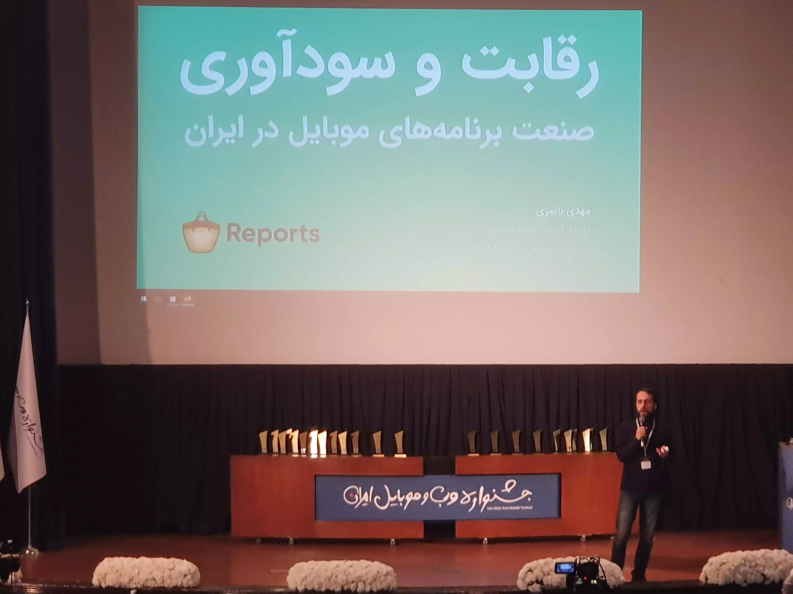
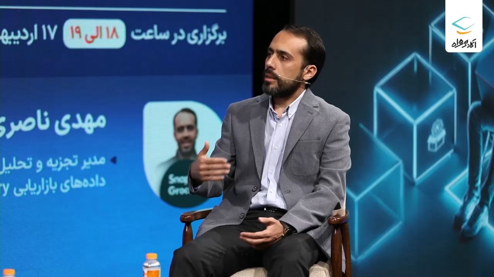
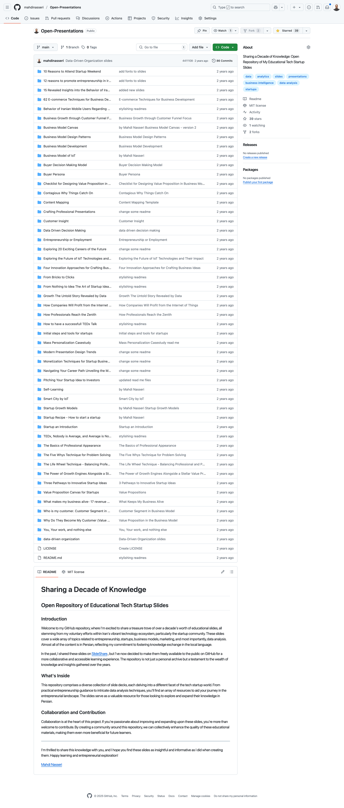
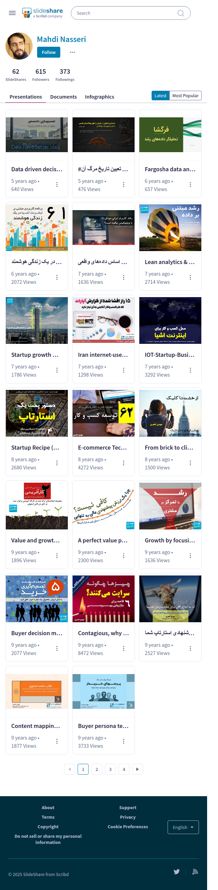

# 🎤 Talks & Workshops

Over the past 15 years, I've given numerous talks and facilitated a wide range of workshops across Iran. My focus has consistently been on making data-driven thinking accessible to a broader audience—from startups and marketers to corporate decision-makers. Below are selected highlights from my speaking and teaching engagements.

## 🎙 TEDx Talk: *No One is Average—and Average is No One*

**TEDxNaghsheJahan | 2018**

In this talk, I explored how misleading averages can be in data analysis, especially in the context of big data. I introduced more nuanced approaches to interpreting data, advocating for deeper understanding rather than surface-level summaries.

* 🌐 [TEDx Official Page](https://www.ted.com/talks/mahdi_nasseri_nobody_is_average_and_average_is_nobody)
* 📺 [Watch on YouTube](https://www.youtube.com/watch?v=vkMHnnJSuf8)

## 🗂️ Open-Source Workshop Materials

**Open-Presentations Repository**

Over the years, I've delivered more than 100 workshops in over 10 cities, covering topics like data analysis, marketing, startups, entrepreneurship, and strategic thinking. I created the **open-presentations** GitHub repository to freely share my slides and resources.

* 🗃️ [Open Presentations on GitHub](https://github.com/mahdinasseri/Open-Presentations)
* 📊 [My Slides on SlideShare](https://www.slideshare.net/mahdinasseri). I used to upload many of my presentations here up until 2020

## 📹 Selected Talk Videos

A selection of recorded talks and webinars across various topics and formats:

* **Iran Web Festival Talk** *(Cafebazaar, 2019)*
  A deep dive into competition and profitability in Iran’s mobile app industry, presented at the Iran Web and Mobile Festival.

  [🎥 Watch on YouTube](https://youtu.be/AD-CWedQfMo?si=p2cjqSZk95cAAtBK) - 📄 [View PDF](assets/pdf/presentations/web-jashnvareh/mahdi-nasseri-v06.pdf)

* **Roshansho Conference (2013)**
  A motivational talk on innovation and future-of-work thinking for a young audience.

  [🎥 Video Link on Aparat](https://www.aparat.com/v/h26vk33)

* **Career Path Webinar** *(Hamrah Academy)*
  A practical session on navigating careers in data analytics.

  [🎥 Video Link - needs registeration](https://hamrah.academy/course/3437)

* **Business Model Education Series (2019)**
  A recorded lecture series introducing core business model frameworks for startup founders for Abisefid coworking space (Isfahan)

  [🎥 Video playlist on Youtube](https://youtube.com/playlist?list=PLFTPcDuDIpmR1pselAKlAg-Jc8cuyF0eK&si=4E4IPMS9bEPBNaJy)

## 🧠 Signature Workshops

A curated list of my most impactful workshops delivered both publicly and for companies:

* **Lean Analytics Bootcamp**  
A hands-on, 16-hour walkthrough of Lean Analytics principles and startup metrics. This workshop is designed and delivered based on the book *Lean Analytics: Use Data to Build a Better Startup Faster* by Alistair Croll and Benjamin Yoskovitz. 
  📄 [View PDF](assets/pdf/presentations/Lean_analytics_webinar_mahdi_nasseri.pdf) - 
  📘 [Lean Analytics on Amazon](https://www.amazon.com/Lean-Analytics-Better-Startup-Faster/dp/1449335675)

* **LTV Fundamentals Workshop** 
  A workshop on understanding, calculating, and optimizing Customer Lifetime Value. 
  📄 [View PDF](assets/pdf/presentations/LTV-Fundamentals.pdf)

* **Retention Calculation: Metrics & Models** 
How to measure and model user retention using actionable metrics and lifecycle analysis. 
📄 [View PDF](assets/pdf/presentations/Retention%20Calculation%20by%20Mahdi%20Nasseri.pdf)

* **Cohort Analysis in Practice** 
  Practical techniques for behavior analysis over time using cohort frameworks. 
  📄 [View PDF](assets/pdf/presentations/CohortAnalysis_by_mahdi_nasseri.pdf)

* **Data Storytelling** *(based on “Storytelling with Data”)* 
  Learn to turn insights into compelling visual stories that drive action. 
  📄 [View PDF](assets/pdf/presentations/Storytelling%20With%20Data%20-%20Analytips.pdf)

* **Customer Segmentation Techniques** 
  Frameworks and models to meaningfully segment users based on behavior and value. 
  📄 [View PDF](assets/pdf/presentations/Customer%20Segmentation.pdf)

* **Understanding Gen Z Behavior Through Data**
  Insights and data trends to understand how Gen Z thinks, behaves, and buys.
  📄 [View PDF](assets/pdf/presentations/Gen%20Z%20Behavior.pdf)

* **Designing the Right Metrics** 
  Methods for creating actionable, context-aware KPIs that reflect strategic goals. 
  📄 [View PDF](assets/pdf/presentations/Metric%20Design.pdf)

* **Data-Driven Decision Making** 
  A workshop on frameworks and mindsets for reducing bias and using evidence in decision-making. 
  📄 [View PDF](assets/pdf/presentations/Data%20Drive%20Decision-Making.pdf)

* **Building a Data-Driven Organization** 
  Culture, tools, and processes required to scale data thinking across an entire organization. 
  📄 [View PDF](assets/pdf/presentations/Building%20a%20Data-Driven%20Organization%20-%20HamrahAvval.pdf)

> For selected decks and materials, visit the [open-presentations repository](https://github.com/mahdinasseri/Open-Presentations).

  

 
