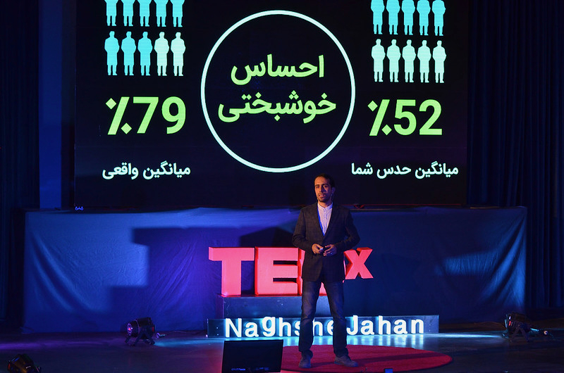

# 🎤 Talks & Workshops

Over the past 15 years, I've given numerous talks and facilitated a wide range of workshops across Iran. My focus has consistently been on making data-driven thinking accessible to a broader audience—from startups and marketers to corporate decision-makers. Below are selected highlights from my speaking and teaching engagements.

---

## 🎙 TEDx Talk: *No One is Average—and Average is No One*

**TEDxNaghsheJahan | 2015**

In this talk, I explored how misleading averages can be in data analysis, especially in the context of big data. I introduced more nuanced approaches to interpreting data, advocating for deeper understanding rather than surface-level summaries.

* 🌐 [TEDx Official Page](https://www.ted.com/talks/mahdi_nasseri_nobody_is_average_and_average_is_nobody)
* 📺 [Watch on YouTube](https://www.youtube.com/watch?v=vkMHnnJSuf8)

---

## 🗂️ Open-Source Workshop Materials

**Open-Presentations Repository**

Over the years, I've delivered more than 100 workshops in over 10 cities, covering topics like data analysis, marketing, startups, entrepreneurship, and strategic thinking. I created the [**open-presentations** GitHub repository](https://github.com/username/open-presentations) to freely share my slides and resources.

* 🗃️ [Open Presentations on GitHub](https://github.com/username/open-presentations)
* 📊 [My Slides on SlideShare](https://www.slideshare.net/yourusername)

---

## 📹 Selected Talk Videos

A selection of recorded talks and webinars across various topics and formats:

* **Iran Web Festival Talk** *(Cafebazaar, 2019)*
  Insights on product strategy, user growth, and the role of marketplaces in Iran's tech ecosystem.
  [🎥 Watch on Aparat or YouTube](https://www.youtube.com/watch?v=dQw4w9WgXcQ)

* **Roshansho Conference (2013)**
  A motivational talk on innovation and future-of-work thinking for a young audience.
  [🎥 Video Link](https://www.youtube.com/watch?v=dQw4w9WgXcQ)

* **Career Path Webinar** *(Hamrah Academy)*
  A practical session on navigating careers in tech, analytics, and product management.
  [🎥 Video Link](https://www.youtube.com/watch?v=dQw4w9WgXcQ)

* **Business Model Education Series (2017)**
  A recorded lecture series introducing core business model frameworks for startup founders.
  [🎥 Video Link](https://www.youtube.com/watch?v=dQw4w9WgXcQ)

---

## 🧠 Signature Workshops

A curated list of my most impactful workshops delivered both publicly and for major companies:

* **Lean Analytics Bootcamp**
  A hands-on, 16-hour walkthrough of Lean Analytics principles and startup metrics.
  📄 [View PDF](https://yourwebsite.com/lean-analytics.pdf)

* **LTV Fundamentals Workshop**
  A workshop on understanding, calculating, and optimizing Customer Lifetime Value.
  📄 [View PDF](https://yourwebsite.com/ltv-workshop.pdf)

* **Cohort Analysis in Practice**
  Practical techniques for behavior analysis over time using cohort frameworks.
  📄 [View PDF](https://yourwebsite.com/cohort-analysis.pdf)

* **Data Storytelling** *(based on “Storytelling with Data”)*
  Learn to turn insights into compelling visual stories that drive action.
  📄 [View PDF](https://yourwebsite.com/data-storytelling.pdf)

* **Customer Segmentation Techniques**
  Frameworks and models to meaningfully segment users based on behavior and value.
  📄 [View PDF](https://yourwebsite.com/segmentation.pdf)

* **Understanding Gen Z Behavior Through Data**
  Insights and data trends to understand how Gen Z thinks, behaves, and buys.
  📄 [View PDF](https://yourwebsite.com/genz-behavior.pdf)

* **Designing the Right Metrics**
  Methods for creating actionable, context-aware KPIs that reflect strategic goals.
  📄 [View PDF](https://yourwebsite.com/metrics-design.pdf)

* **Data-Driven Decision Making**
  A workshop on frameworks and mindsets for reducing bias and using evidence in decision-making.
  📄 [View PDF](https://yourwebsite.com/data-decision.pdf)

* **Building a Data-Driven Organization**
  Culture, tools, and processes required to scale data thinking across an entire organization.
  📄 [View PDF](https://yourwebsite.com/data-org.pdf)

> For selected decks and materials, visit the [open-presentations repository](https://github.com/username/open-presentations).
