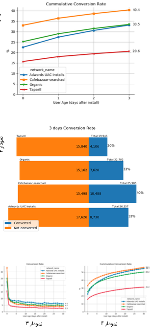
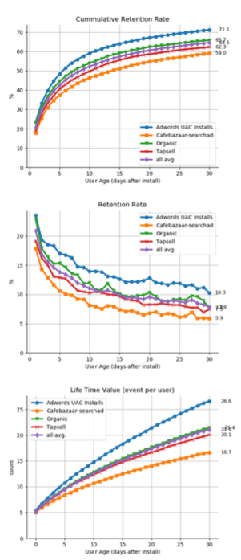
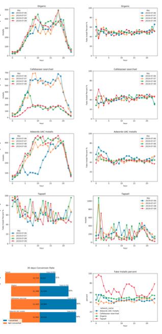

# 📊 Data Analyst Portfolio

Welcome to my data analyst portfolio. Below is a curated list of real-world projects I've completed, showcasing my skills in data cleaning, analysis, visualization, and storytelling to drive business decisions.

---

## 🚀 Projects

### 1. **User Quality & Retention Analysis for Divar App Installs**

- **Goal:** Compare user quality across ad networks and detect suspicious install behavior for the Divar app.
- **Description:** Analyzed user install and in-app event data to assess engagement, retention, and potential fraud.
- **Skills:** Applied data cleaning, retention analysis, LTV estimation, and anomaly detection techniques.
- **Technologies:** Used Python (Pandas, Matplotlib), Jupyter, and Google Drive for analysis and visualization.
- **Results:** Identified top-performing networks (Adwords, CafeBazaar), flagged Tapsell for fake installs, and revealed retention patterns.

[Link to project repository](https://github.com/mahdinasseri/Ads-Networks-Performance-and-Fraud-Analysis)

---

---

<!-- Add more projects in the format below:

### 2. **[Project Title]**
**Client:** [Client or Company Name]  
**Date:** [Month/Year]  
**Tools:** [Tech stack]

[Brief description of the business problem, your analysis process, key findings, and impact.]

📎 *Skills demonstrated:* [Key skills]

-->
