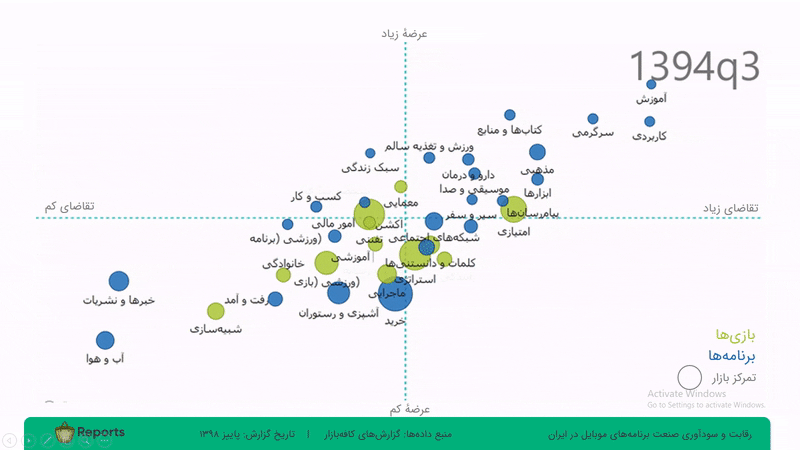
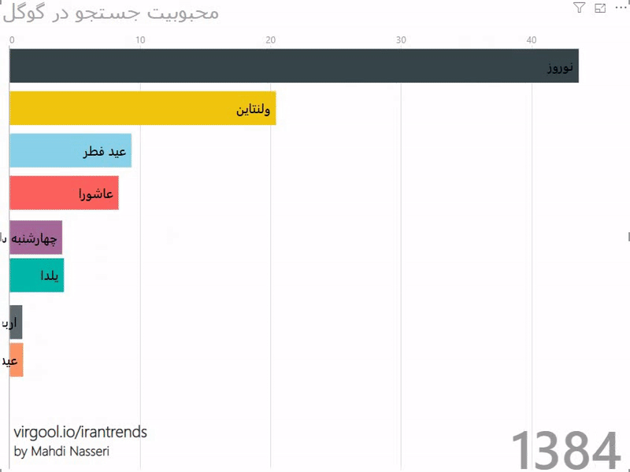
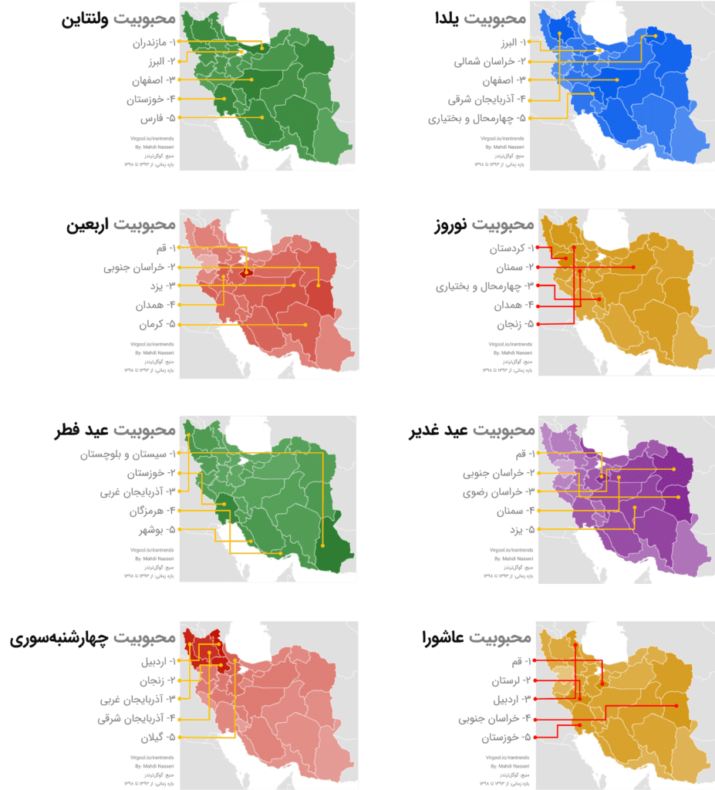
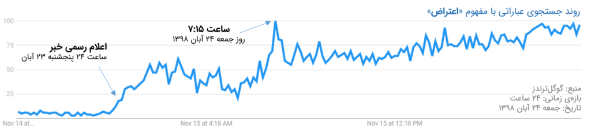
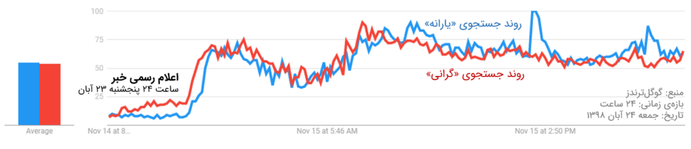

# storytelling-with-data

## Data Journalism Award – Daqiqeh (Iran, 2023)
Submitted three data journalism articles to the inaugural *[Daqiqeh Data Journalism Award](https://d-mag.ir/pcategory/djprize/1402/)* in Iran. One article won **Third Place**, and two others received **Honorable Mentions**.

* **Third Place**: *Yalda and Valentine: A Paradigm Shift – An Analysis of the Popularity Trends of Cultural Celebrations in Iran* \[[link](https://d-mag.ir/p14348/) and [pdf](assets/storytelling-with-data/datajournalism-award/04-Iran_Celeberations_by_Mahdi_Nasseri.pdf) in Persian]
* **Honorable Mention**: *Competition and Profitability in Iran's Mobile App Industry* \[[link](https://d-mag.ir/p14710/) and [pdf](assets/storytelling-with-data/datajournalism-award/01-App_Market_by_Mahdi_Nasseri.pdf) in Persian]
* **Honorable Mention**: *Public Sentiment in the First 24 Hours After the Gasoline Price Hike* \[[link](https://d-mag.ir/p14735/) and [pdf](assets/storytelling-with-data/datajournalism-award/02-Benzin_by_Mahdi_Nasseri.pdf) in Persian]

---
